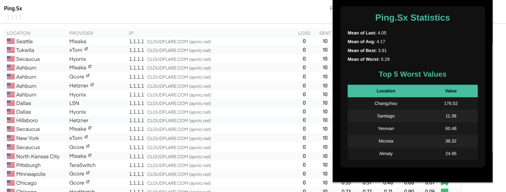

# ping.sx overview

  

It's an Extension to calculate the global latency from all locations of the current [ping.sx](https://ping.sx) page.

## Usage

1. Visit the [Ping.sx Overview](https://addons.mozilla.org/en-US/firefox/addon/ping-sx-overview/) add-on page and add it to your browser.
2. Click on the extension icon in the toolbar or extension list.

This extension will work on a `ping.sx` ping page, for example, [ping.sx/ping?t=1.1.1.1](https://ping.sx/ping?t=1.1.1.1).

---

## Support 💛

 

## Contributing 🤝

Don't be shy and reach out to us if you want to contribute 😉

1. Fork it!
2. Create your feature branch: `git checkout -b my-new-feature`
3. Commit your changes: `git commit -am 'Add some feature'`
4. Push to the branch: `git push origin my-new-feature`
5. Submit a pull request

## Issues

Each project may have many problems. Contributing to the better development of this project by reporting them.
